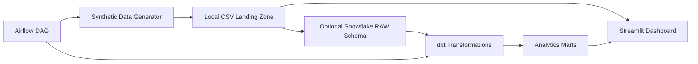

# Home Care Intelligence Hub

A local-first analytics demo for home health referral operations. It simulates the path from hospital discharge referral to payor authorization to first completed home visit, then surfaces the metrics an operations director needs every week.

## What It Answers

1. Where are referrals dropping off before the first visit?
2. Which payors are delaying authorizations and creating revenue risk?
3. Are clinicians over capacity, underutilized, or missing visits?

## Architecture



The default demo path is local CSV to Streamlit, so no warehouse credentials are required. The dbt and Airflow files document the production-style path for Snowflake-backed deployments.

## Tech Stack

- Python 3.11, pandas, Faker
- Streamlit and Plotly for the dashboard
- dbt + Snowflake for the optional warehouse transformation layer
- Airflow DAG for orchestration
- Pytest and GitHub Actions for validation

## Project Structure

```text
dashboard/                 Streamlit app, pages, and local metric helpers
data/synthetic/            Generated CSV demo data
dbt/                       Snowflake dbt project, sources, tests, and marts
ingestion/airbyte/         Reference raw-load configuration
orchestration/dags/        Airflow DAG for the daily pipeline
scripts/                   Synthetic data generator
tests/                     Generator and dashboard-metric tests
```

## Local Quickstart

```bash
python -m venv .venv
source .venv/bin/activate
pip install -r requirements.txt
python scripts/generate_synthetic_data.py
streamlit run dashboard/app.py
```

Open the Streamlit URL and use the sidebar pages:

- `Referral Funnel`
- `Payor Authorization Lag`
- `Clinician Utilization`

## Docker

```bash
docker compose up --build
```

The container regenerates synthetic data and starts Streamlit on `http://localhost:8501`.

## Optional Snowflake/dbt Path

1. Copy the environment template:

```bash
cp .env.example .env
```

2. Fill in Snowflake values in `.env`.
3. Load `data/synthetic/*.csv` into the Snowflake `RAW` schema using your preferred loader or the reference Airbyte sketch in `ingestion/airbyte/connections.yaml`.
4. Run dbt:

```bash
cd dbt
dbt run --profiles-dir .
dbt test --profiles-dir .
```

The dbt project builds:

- `mart_patient_referral_funnel`
- `mart_payor_authorization_lag`
- `mart_clinician_utilization`

## Airflow

The DAG `home_care_daily_pipeline` is defined in `orchestration/dags/home_care_pipeline.py`. It is import-safe without Airflow installed, and in an Airflow environment it runs:

```text
generate_synthetic_data -> dbt_run -> dbt_test -> dashboard_ready
```

## Data Quality

The repo includes:

- dbt source declarations for the raw tables
- generic dbt tests for keys, statuses, and required mart fields
- pytest coverage for data generation and local dashboard mart logic
- CI that generates a small dataset, runs pytest, compiles Python files, and builds the Docker image

## HIPAA Note

All data is synthetic and generated with Faker. No real patient data is used. In a production PHI environment, fields like date of birth, insurance member ID, address, and any patient identifiers would require masking, access controls, audit logging, and retention policies.

## Roadmap

- Add an automated Snowflake CSV load script or dbt seed path.
- Add incremental dbt models for larger referral histories.
- Add dbt docs publishing and lineage artifacts.
- Add a prediction-ready feature mart for authorization approval risk.
